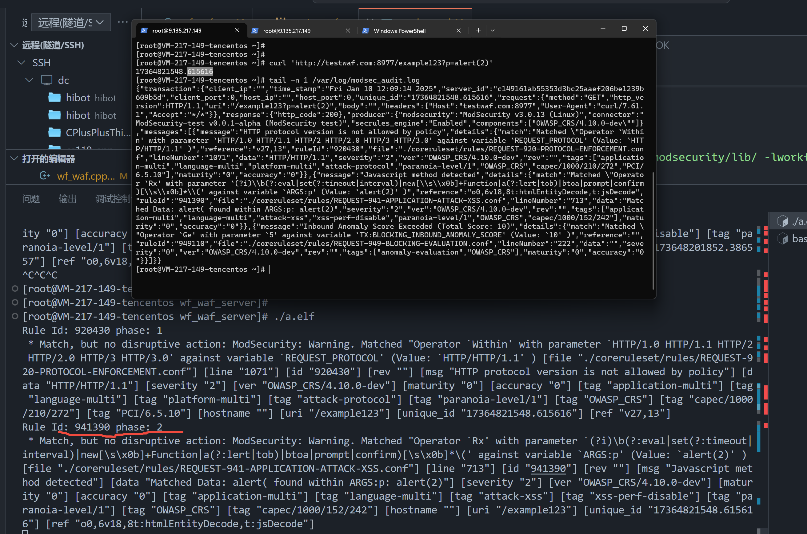

# workflow + modsecurity 打造软waf
- http server waf and modsecurity backend 

## install guide 
```bash

#https://github.com/owasp-modsecurity/ModSecurity/wiki/Compilation-recipes-for-v3.x#centos-7-minimal

yum install gcc-c++ flex bison yajl yajl-devel curl-devel curl GeoIP-devel doxygen zlib-devel pcre-devel
cd /opt/
git clone https://github.com/owasp-modsecurity/ModSecurity
cd ModSecurity
git checkout -b v3/master origin/v3/master
sh build.sh
git submodule init
git submodule update
./configure
yum install https://archives.fedoraproject.org/pub/archive/fedora/linux/updates/23/x86_64/b/bison-3.0.4-3.fc23.x86_64.rpm
make -j$(nproc)
make install

```

## build 2024.12.12 with httplib 
>  g++ ./src/httplib_waf.cpp -I /usr/local/modsecurity/include/ -L /usr/local/modsecurity/lib/ -lpthread -std=c++17 -lmodsecurity -O3 -g -o a.elf -I ./contrib/include/

我们用 httplib-cpp 是可以的； 但是使用 workflow就不行了。

## build 2024.12.24 transcation非独立事务时OK 【RECOMENDED】
>  g++ ./src/wf_waf.cpp -I /usr/local/modsecurity/include/ -L /usr/local/modsecurity/lib/ -lworkflow -lpthread -std=c++17 -lmodsecurity -O3 -g -o a.elf -I ./contrib/include/




# BUG AND REPAIRE LOG
## bug 2025.1.6  --- fix (1.6)
- 当前遇到问题 modsecurity parse all http error.

## bug 2025.1.7 --- fix (1.10)
- 需要遇到了match - 就进行响应； 另外手动进行过滤一些； 无法脱离log做到这个内容。
    - 已解决，这里操作 transcation 对象专门有一个阻断器，intervention 这样就可以达到这个效果，【已解决】
    - [that](https://github.com/owasp-modsecurity/ModSecurity/blob/v3/master/examples/using_bodies_in_chunks/simple_request.cc#L95-L129)


